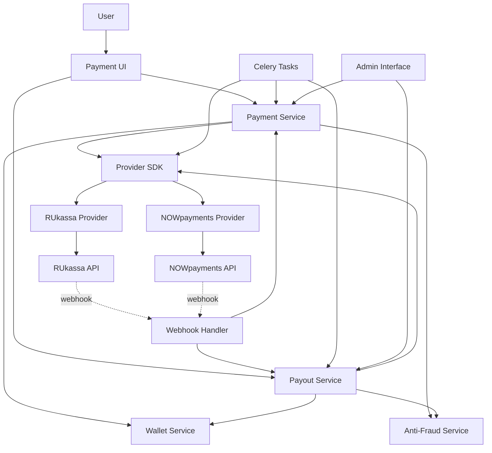

# Design Document: Payment System Integration

## Overview

This design document specifies the technical implementation for integrating real payment systems into the DOD platform. The system will support two payment providers:

1. **RUkassa** - Fiat payment processing (cards, SBP, e-wallets, mobile payments) for RUB, UAH, KZT, UZS, BYN
2. **NOWpayments** - Cryptocurrency processing (BTC, ETH, USDT, TON, 200+ coins) with auto-conversion

The design follows a provider abstraction pattern, making it easy to add new payment providers in the future. The system handles the complete payment lifecycle: order creation, provider API integration, webhook processing, wallet crediting, fraud detection, and administrative oversight.

### Key Design Principles

- **Provider Abstraction**: Unified interface for all payment providers
- **Idempotency**: Duplicate webhooks never duplicate credits
- **Security First**: Signature verification, IP whitelisting, encryption
- **Resilience**: Retry logic, circuit breakers, graceful degradation
- **Auditability**: Comprehensive logging of all payment events
- **Atomicity**: Database transactions ensure consistency

## Architecture

### High-Level Architecture



### Component Layers


1. **Presentation Layer**: Django views and templates for user interaction
2. **Service Layer**: Business logic for payments, payouts, fraud detection
3. **Provider Layer**: Abstract SDK and concrete provider implementations
4. **Data Layer**: Django models for persistence
5. **Integration Layer**: Webhook handlers and background tasks
6. **Admin Layer**: Django admin customizations for management

## Components and Interfaces

### 1. Provider SDK (apps/payments/providers/)

#### BasePaymentProvider (Abstract Class)

```python
from abc import ABC, abstractmethod
from decimal import Decimal
from typing import Dict, Any, Optional, Tuple
from dataclasses import dataclass

@dataclass
class DepositResponse:
    success: bool
    provider_order_id: str
    payment_url: Optional[str] = None
    crypto_address: Optional[str] = None
    crypto_network: Optional[str] = None
    amount: Optional[Decimal] = None
    expires_at: Optional[datetime] = None
    error_message: Optional[str] = None
    raw_response: Dict[str, Any] = None

@dataclass
class PayoutResponse:
    success: bool
    provider_payout_id: str
    status: str  # 'processing', 'completed', 'failed'
    error_message: Optional[str] = None
    raw_response: Dict[str, Any] = None

@dataclass
class StatusResponse:
    status: str  # Internal status mapping
    provider_status: str
    amount_received: Optional[Decimal] = None
    completed_at: Optional[datetime] = None
    error_message: Optional[str] = None

class BasePaymentProvider(ABC):
    def __init__(self, provider: PaymentProvider):
        self.provider = provider
        self.api_key = provider.api_key
        self.api_secret = provider.api_secret
        self.api_base_url = provider.api_base_url
        self.timeout = 30
    
    @abstractmethod
    def create_deposit(
        self,
        order_id: str,
        amount: Decimal,
        currency: str,
        payment_method_code: str,
        user_email: str,
        success_url: str,
        fail_url: str,
        **kwargs
    ) -> DepositResponse:
        """Create a deposit order with the provider."""
        pass
    
    @abstractmethod
    def check_deposit_status(self, provider_order_id: str) -> StatusResponse:
        """Query the provider for deposit status."""
        pass
    
    @abstractmethod
    def create_payout(
        self,
        payout_id: str,
        amount: Decimal,
        currency: str,
        payment_details: Dict[str, Any],
        **kwargs
    ) -> PayoutResponse:
        """Create a payout order with the provider."""
        pass
    
    @abstractmethod
    def check_payout_status(self, provider_payout_id: str) -> StatusResponse:
        """Query the provider for payout status."""
        pass
    
    @abstractmethod
    def verify_webhook_signature(
        self,
        payload: Dict[str, Any],
        signature: str,
        headers: Dict[str, str]
    ) -> bool:
        """Verify webhook signature authenticity."""
        pass
    
    @abstractmethod
    def parse_webhook(self, payload: Dict[str, Any]) -> Dict[str, Any]:
        """Parse webhook payload into standardized format."""
        pass
    
    def _map_status(self, provider_status: str) -> str:
        """Map provider-specific status to internal status."""
        pass
    
    def _make_request(
        self,
        method: str,
        endpoint: str,
        data: Optional[Dict] = None,
        headers: Optional[Dict] = None
    ) -> Dict[str, Any]:
        """Make HTTP request to provider API with error handling."""
        pass
```

#### RUkassaProvider Implementation


```python
import hashlib
import requests
from decimal import Decimal
from typing import Dict, Any

class RUkassaProvider(BasePaymentProvider):
    """
    RUkassa API Integration
    
    API Documentation: https://rukassa.is/api-documentation
    
    Supported Methods:
    - bank_card: Visa, MasterCard, МИР
    - sbp: Fast Payment System
    - qiwi: QIWI Wallet
    - yoomoney: ЮMoney
    - mobile: Mobile payments
    
    Webhook Signature: MD5(shop_id:order_id:amount:status:secret)
    """
    
    def create_deposit(
        self,
        order_id: str,
        amount: Decimal,
        currency: str,
        payment_method_code: str,
        user_email: str,
        success_url: str,
        fail_url: str,
        **kwargs
    ) -> DepositResponse:
        endpoint = "/api/v1/create"
        data = {
            "shop_id": self.provider.merchant_id,
            "order_id": order_id,
            "amount": str(amount),
            "currency": currency,
            "method": payment_method_code,
            "email": user_email,
            "success_url": success_url,
            "fail_url": fail_url,
            "sign": self._generate_signature(order_id, amount, currency)
        }
        
        try:
            response = self._make_request("POST", endpoint, data)
            return DepositResponse(
                success=True,
                provider_order_id=response["payment_id"],
                payment_url=response["payment_url"],
                expires_at=timezone.now() + timedelta(minutes=30),
                raw_response=response
            )
        except Exception as e:
            return DepositResponse(
                success=False,
                provider_order_id="",
                error_message=str(e)
            )
    
    def check_deposit_status(self, provider_order_id: str) -> StatusResponse:
        endpoint = f"/api/v1/status/{provider_order_id}"
        response = self._make_request("GET", endpoint)
        
        return StatusResponse(
            status=self._map_status(response["status"]),
            provider_status=response["status"],
            amount_received=Decimal(response.get("amount_received", 0)),
            completed_at=self._parse_datetime(response.get("completed_at"))
        )
    
    def create_payout(
        self,
        payout_id: str,
        amount: Decimal,
        currency: str,
        payment_details: Dict[str, Any],
        **kwargs
    ) -> PayoutResponse:
        endpoint = "/api/v1/payout"
        data = {
            "shop_id": self.provider.merchant_id,
            "payout_id": payout_id,
            "amount": str(amount),
            "currency": currency,
            "method": payment_details["method"],
            "account": payment_details["account"],
            "sign": self._generate_payout_signature(payout_id, amount, currency)
        }
        
        response = self._make_request("POST", endpoint, data)
        return PayoutResponse(
            success=response["success"],
            provider_payout_id=response["payout_id"],
            status=self._map_status(response["status"]),
            raw_response=response
        )
    
    def verify_webhook_signature(
        self,
        payload: Dict[str, Any],
        signature: str,
        headers: Dict[str, str]
    ) -> bool:
        expected = self._generate_webhook_signature(
            payload["shop_id"],
            payload["order_id"],
            payload["amount"],
            payload["status"]
        )
        return signature == expected
    
    def parse_webhook(self, payload: Dict[str, Any]) -> Dict[str, Any]:
        return {
            "order_id": payload["order_id"],
            "provider_order_id": payload["payment_id"],
            "status": self._map_status(payload["status"]),
            "amount": Decimal(payload["amount"]),
            "currency": payload["currency"],
            "provider_status": payload["status"]
        }
    
    def _generate_signature(self, order_id: str, amount: Decimal, currency: str) -> str:
        string = f"{self.provider.merchant_id}:{order_id}:{amount}:{currency}:{self.provider.webhook_secret}"
        return hashlib.md5(string.encode()).hexdigest()
    
    def _generate_webhook_signature(self, shop_id: str, order_id: str, amount: str, status: str) -> str:
        string = f"{shop_id}:{order_id}:{amount}:{status}:{self.provider.webhook_secret}"
        return hashlib.md5(string.encode()).hexdigest()
    
    def _map_status(self, provider_status: str) -> str:
        mapping = {
            "new": "created",
            "pending": "pending",
            "processing": "processing",
            "success": "completed",
            "failed": "failed",
            "expired": "expired",
            "cancelled": "cancelled"
        }
        return mapping.get(provider_status, "pending")
```

#### NOWpaymentsProvider Implementation

```python
import hmac
import hashlib
import requests
from decimal import Decimal
from typing import Dict, Any

class NOWpaymentsProvider(BasePaymentProvider):
    """
    NOWpayments API Integration
    
    API Documentation: https://documenter.getpostman.com/view/7907941/S1a32n38
    
    Supported Cryptocurrencies: BTC, ETH, USDT, TON, and 200+ others
    
    Webhook Signature: HMAC SHA-512
    """
    
    def create_deposit(
        self,
        order_id: str,
        amount: Decimal,
        currency: str,
        payment_method_code: str,  # cryptocurrency code
        user_email: str,
        success_url: str,
        fail_url: str,
        **kwargs
    ) -> DepositResponse:
        endpoint = "/v1/payment"
        
        # Auto-conversion to stablecoin if configured
        pay_currency = payment_method_code
        if self.provider.extra_settings.get("auto_convert_to_stablecoin"):
            pay_currency = "usdttrc20"  # Default stablecoin
        
        data = {
            "price_amount": str(amount),
            "price_currency": currency,
            "pay_currency": pay_currency,
            "order_id": order_id,
            "order_description": f"Deposit {order_id}",
            "ipn_callback_url": kwargs.get("webhook_url"),
            "success_url": success_url,
            "cancel_url": fail_url
        }
        
        headers = {"x-api-key": self.api_key}
        response = self._make_request("POST", endpoint, data, headers)
        
        return DepositResponse(
            success=True,
            provider_order_id=response["payment_id"],
            payment_url=response["invoice_url"],
            crypto_address=response["pay_address"],
            crypto_network=response.get("network"),
            amount=Decimal(response["pay_amount"]),
            expires_at=self._parse_datetime(response.get("expiration_estimate_date")),
            raw_response=response
        )
    
    def check_deposit_status(self, provider_order_id: str) -> StatusResponse:
        endpoint = f"/v1/payment/{provider_order_id}"
        headers = {"x-api-key": self.api_key}
        response = self._make_request("GET", endpoint, headers=headers)
        
        return StatusResponse(
            status=self._map_status(response["payment_status"]),
            provider_status=response["payment_status"],
            amount_received=Decimal(response.get("actually_paid", 0)),
            completed_at=self._parse_datetime(response.get("updated_at"))
        )
    
    def create_payout(
        self,
        payout_id: str,
        amount: Decimal,
        currency: str,
        payment_details: Dict[str, Any],
        **kwargs
    ) -> PayoutResponse:
        endpoint = "/v1/payout"
        data = {
            "withdrawals": [{
                "address": payment_details["crypto_address"],
                "currency": currency,
                "amount": str(amount),
                "ipn_callback_url": kwargs.get("webhook_url"),
                "extra_id": payout_id
            }]
        }
        
        headers = {"x-api-key": self.api_key}
        response = self._make_request("POST", endpoint, data, headers)
        
        withdrawal = response["withdrawals"][0]
        return PayoutResponse(
            success=True,
            provider_payout_id=withdrawal["id"],
            status=self._map_status(withdrawal["status"]),
            raw_response=response
        )
    
    def verify_webhook_signature(
        self,
        payload: Dict[str, Any],
        signature: str,
        headers: Dict[str, str]
    ) -> bool:
        # NOWpayments uses HMAC SHA-512
        import json
        message = json.dumps(payload, separators=(',', ':'), sort_keys=True)
        expected = hmac.new(
            self.provider.webhook_secret.encode(),
            message.encode(),
            hashlib.sha512
        ).hexdigest()
        return hmac.compare_digest(signature, expected)
    
    def parse_webhook(self, payload: Dict[str, Any]) -> Dict[str, Any]:
        return {
            "order_id": payload["order_id"],
            "provider_order_id": payload["payment_id"],
            "status": self._map_status(payload["payment_status"]),
            "amount": Decimal(payload.get("actually_paid", payload["pay_amount"])),
            "currency": payload["pay_currency"],
            "provider_status": payload["payment_status"]
        }
    
    def _map_status(self, provider_status: str) -> str:
        mapping = {
            "waiting": "pending",
            "confirming": "processing",
            "confirmed": "completed",
            "sending": "processing",
            "partially_paid": "processing",
            "finished": "completed",
            "failed": "failed",
            "refunded": "refunded",
            "expired": "expired"
        }
        return mapping.get(provider_status, "pending")
```

### 2. Payment Service (apps/payments/services/payment_service.py)


```python
from decimal import Decimal
from typing import Optional, Dict, Any
from django.db import transaction
from django.utils import timezone
from datetime import timedelta

from apps.payments.models import DepositOrder, PaymentProvider, PaymentMethod
from apps.payments.providers import get_provider_instance
from apps.wallet.services import WalletService
from apps.payments.services.anti_fraud_service import AntiFraudService

class PaymentService:
    """
    Core service for managing deposit lifecycle.
    
    Responsibilities:
    - Create deposit orders
    - Interact with provider SDK
    - Process webhook confirmations
    - Credit user wallets
    - Ensure idempotency
    """
    
    def __init__(self):
        self.wallet_service = WalletService()
        self.anti_fraud_service = AntiFraudService()
    
    def create_deposit(
        self,
        user,
        wallet,
        payment_method_id: str,
        amount: Decimal,
        ip_address: str,
        user_agent: str
    ) -> DepositOrder:
        """
        Create a new deposit order.
        
        Steps:
        1. Validate amount against limits
        2. Run anti-fraud checks
        3. Create DepositOrder record
        4. Call provider SDK to generate payment details
        5. Update order with provider response
        """
        payment_method = PaymentMethod.objects.select_related('provider', 'currency').get(id=payment_method_id)
        
        # Validate amount
        if amount < payment_method.min_amount:
            raise ValueError(f"Amount below minimum: {payment_method.min_amount}")
        if amount > payment_method.max_amount:
            raise ValueError(f"Amount exceeds maximum: {payment_method.max_amount}")
        
        # Anti-fraud checks
        fraud_check = self.anti_fraud_service.check_deposit(user, amount, payment_method.currency, ip_address)
        if fraud_check["blocked"]:
            raise ValueError(f"Deposit blocked: {fraud_check['reason']}")
        
        # Create order
        with transaction.atomic():
            order = DepositOrder.objects.create(
                user=user,
                wallet=wallet,
                provider=payment_method.provider,
                payment_method=payment_method,
                currency=payment_method.currency,
                amount=amount,
                amount_usd=amount * payment_method.currency.rate_to_usd,
                fee_amount=self._calculate_fee(amount, payment_method),
                status="created",
                ip_address=ip_address,
                user_agent=user_agent,
                expires_at=timezone.now() + timedelta(minutes=30),
                success_url=self._build_success_url(order.order_id),
                fail_url=self._build_fail_url(order.order_id)
            )
            
            # Call provider
            provider_instance = get_provider_instance(payment_method.provider)
            response = provider_instance.create_deposit(
                order_id=order.order_id,
                amount=amount,
                currency=payment_method.currency.code,
                payment_method_code=payment_method.code,
                user_email=user.email,
                success_url=order.success_url,
                fail_url=order.fail_url,
                webhook_url=self._build_webhook_url(payment_method.provider.code)
            )
            
            if response.success:
                order.provider_order_id = response.provider_order_id
                order.provider_payment_url = response.payment_url
                order.crypto_address = response.crypto_address
                order.crypto_network = response.crypto_network
                order.provider_response = response.raw_response
                order.status = "pending"
            else:
                order.status = "failed"
                order.provider_response = {"error": response.error_message}
            
            order.save()
        
        return order
    
    def process_webhook_confirmation(
        self,
        provider_code: str,
        webhook_data: Dict[str, Any]
    ) -> bool:
        """
        Process webhook confirmation from provider.
        
        Steps:
        1. Find the DepositOrder by order_id
        2. Check idempotency (already completed?)
        3. Validate status transition
        4. Credit wallet atomically
        5. Update order status
        
        Returns True if processed, False if duplicate/invalid
        """
        order_id = webhook_data["order_id"]
        
        with transaction.atomic():
            # Lock the order row
            order = DepositOrder.objects.select_for_update().get(order_id=order_id)
            
            # Idempotency check
            if order.status == "completed":
                return False  # Already processed
            
            # Validate status transition
            if not order.can_be_completed():
                raise ValueError(f"Order {order_id} cannot be completed from status {order.status}")
            
            # Update order
            order.status = webhook_data["status"]
            order.provider_status = webhook_data["provider_status"]
            order.amount_received = webhook_data.get("amount", order.amount)
            
            if order.status == "completed":
                # Credit wallet
                txn = self.wallet_service.credit_wallet(
                    wallet=order.wallet,
                    amount=order.amount_received,
                    currency=order.currency,
                    transaction_type="deposit",
                    reference_type="deposit_order",
                    reference_id=str(order.id),
                    description=f"Deposit via {order.provider.name}",
                    ip_address=order.ip_address
                )
                
                order.transaction = txn
                order.completed_at = timezone.now()
            
            order.save()
        
        return True
    
    def check_pending_deposits(self):
        """
        Background task: Check status of pending deposits.
        Called every 5 minutes as backup if webhook fails.
        """
        pending_orders = DepositOrder.objects.filter(
            status__in=["pending", "processing"],
            expires_at__gt=timezone.now()
        ).select_related('provider')
        
        for order in pending_orders:
            try:
                provider_instance = get_provider_instance(order.provider)
                status_response = provider_instance.check_deposit_status(order.provider_order_id)
                
                if status_response.status == "completed":
                    self.process_webhook_confirmation(
                        order.provider.code,
                        {
                            "order_id": order.order_id,
                            "status": "completed",
                            "provider_status": status_response.provider_status,
                            "amount": status_response.amount_received
                        }
                    )
            except Exception as e:
                logger.error(f"Error checking deposit {order.order_id}: {e}")
    
    def expire_old_deposits(self):
        """
        Background task: Expire deposits that haven't been paid.
        """
        expired_orders = DepositOrder.objects.filter(
            status__in=["created", "pending"],
            expires_at__lte=timezone.now()
        )
        expired_orders.update(status="expired")
    
    def _calculate_fee(self, amount: Decimal, payment_method: PaymentMethod) -> Decimal:
        fee = payment_method.fee_fixed + (amount * payment_method.fee_percent / 100)
        return fee.quantize(Decimal("0.00000001"))
    
    def _build_success_url(self, order_id: str) -> str:
        return f"{settings.SITE_URL}/wallet/?deposit=success&order={order_id}"
    
    def _build_fail_url(self, order_id: str) -> str:
        return f"{settings.SITE_URL}/wallet/?deposit=fail&order={order_id}"
    
    def _build_webhook_url(self, provider_code: str) -> str:
        return f"{settings.SITE_URL}/webhooks/payments/{provider_code}/"
```

### 3. Payout Service (apps/payments/services/payout_service.py)

```python
from decimal import Decimal
from typing import Optional
from django.db import transaction
from django.utils import timezone

from apps.payments.models import PayoutOrder, PaymentProvider
from apps.payments.providers import get_provider_instance
from apps.wallet.models import WithdrawalRequest
from apps.payments.services.anti_fraud_service import AntiFraudService

class PayoutService:
    """
    Core service for managing withdrawal/payout lifecycle.
    
    Responsibilities:
    - Create payout orders from approved withdrawals
    - Interact with provider SDK
    - Process webhook confirmations
    - Handle retry logic
    """
    
    def __init__(self):
        self.anti_fraud_service = AntiFraudService()
    
    def create_payout(self, withdrawal_request: WithdrawalRequest) -> PayoutOrder:
        """
        Create a payout order from an approved withdrawal request.
        
        Steps:
        1. Select appropriate payment provider
        2. Create PayoutOrder record
        3. Call provider SDK to initiate payout
        4. Update order with provider response
        """
        # Select provider based on payment method and currency
        provider = self._select_provider(
            withdrawal_request.payment_method,
            withdrawal_request.currency
        )
        
        payment_method = self._get_payment_method(provider, withdrawal_request)
        
        with transaction.atomic():
            payout = PayoutOrder.objects.create(
                withdrawal_request=withdrawal_request,
                user=withdrawal_request.user,
                provider=provider,
                payment_method=payment_method,
                currency=withdrawal_request.currency,
                amount=withdrawal_request.amount,
                fee_amount=withdrawal_request.fee_amount,
                net_amount=withdrawal_request.net_amount,
                payment_details=withdrawal_request.payment_details,
                status="created"
            )
            
            # Initiate payout with provider
            success = self._initiate_payout(payout)
            
            if success:
                withdrawal_request.status = "processing"
                withdrawal_request.save()
        
        return payout
    
    def _initiate_payout(self, payout: PayoutOrder) -> bool:
        """
        Call provider SDK to initiate payout.
        """
        try:
            provider_instance = get_provider_instance(payout.provider)
            response = provider_instance.create_payout(
                payout_id=payout.payout_id,
                amount=payout.net_amount,
                currency=payout.currency.code,
                payment_details=payout.payment_details,
                webhook_url=self._build_webhook_url(payout.provider.code)
            )
            
            payout.provider_payout_id = response.provider_payout_id
            payout.provider_response = response.raw_response
            payout.provider_status = response.status
            
            if response.success:
                payout.status = "processing"
            else:
                payout.status = "failed"
                payout.error_message = response.error_message
            
            payout.save()
            return response.success
            
        except Exception as e:
            payout.status = "failed"
            payout.error_message = str(e)
            payout.save()
            return False
    
    def process_webhook_confirmation(self, provider_code: str, webhook_data: Dict[str, Any]) -> bool:
        """
        Process payout webhook confirmation.
        """
        payout_id = webhook_data.get("payout_id") or webhook_data.get("extra_id")
        
        with transaction.atomic():
            payout = PayoutOrder.objects.select_for_update().get(payout_id=payout_id)
            
            # Update status
            payout.provider_status = webhook_data["provider_status"]
            
            if webhook_data["status"] == "completed":
                payout.status = "completed"
                payout.completed_at = timezone.now()
                
                # Update withdrawal request
                payout.withdrawal_request.status = "completed"
                payout.withdrawal_request.completed_at = timezone.now()
                payout.withdrawal_request.save()
                
            elif webhook_data["status"] == "failed":
                payout.status = "failed"
                payout.error_message = webhook_data.get("error_message")
            
            payout.save()
        
        return True
    
    def retry_failed_payouts(self):
        """
        Background task: Retry failed payouts with exponential backoff.
        """
        failed_payouts = PayoutOrder.objects.filter(
            status="failed",
            retry_count__lt=models.F('max_retries')
        )
        
        for payout in failed_payouts:
            # Exponential backoff: 1 min, 5 min, 15 min
            delay_minutes = [1, 5, 15][payout.retry_count]
            if timezone.now() >= payout.updated_at + timedelta(minutes=delay_minutes):
                payout.retry_count += 1
                payout.save()
                self._initiate_payout(payout)
    
    def _select_provider(self, payment_method: str, currency) -> PaymentProvider:
        """Select appropriate provider based on payment method and currency."""
        if payment_method == "crypto":
            return PaymentProvider.objects.get(code="nowpayments", is_active=True)
        else:
            return PaymentProvider.objects.get(code="rukassa", is_active=True)
    
    def _get_payment_method(self, provider: PaymentProvider, withdrawal: WithdrawalRequest):
        """Get the appropriate PaymentMethod for the payout."""
        return provider.methods.filter(
            currency=withdrawal.currency,
            type__in=["withdrawal", "both"],
            is_active=True
        ).first()
    
    def _build_webhook_url(self, provider_code: str) -> str:
        return f"{settings.SITE_URL}/webhooks/payouts/{provider_code}/"
```

### 4. Webhook Handler (apps/payments/webhooks/handler.py)


```python
import json
import time
from typing import Dict, Any, Tuple
from django.http import HttpResponse, JsonResponse
from django.views.decorators.csrf import csrf_exempt
from django.views.decorators.http import require_POST
from django.utils import timezone

from apps.payments.models import WebhookLog, PaymentProvider
from apps.payments.providers import get_provider_instance
from apps.payments.services.payment_service import PaymentService
from apps.payments.services.payout_service import PayoutService

class WebhookHandler:
    """
    Handles incoming webhooks from payment providers.
    
    Security measures:
    - IP whitelisting
    - Signature verification
    - Comprehensive logging
    - Idempotency
    """
    
    # Provider IP whitelists
    IP_WHITELISTS = {
        "rukassa": [
            "185.71.76.0/27",
            "185.71.77.0/27",
            "77.83.247.0/27"
        ],
        "nowpayments": [
            "18.209.98.55",
            "52.200.159.85",
            "54.236.28.238"
        ]
    }
    
    def __init__(self):
        self.payment_service = PaymentService()
        self.payout_service = PayoutService()
    
    @csrf_exempt
    @require_POST
    def handle_deposit_webhook(self, request, provider_code: str) -> HttpResponse:
        """
        Handle deposit webhook from provider.
        
        Steps:
        1. Log webhook
        2. Verify IP
        3. Verify signature
        4. Parse webhook
        5. Process confirmation
        6. Return response
        """
        start_time = time.time()
        
        # Parse payload
        try:
            payload = json.loads(request.body)
        except json.JSONDecodeError:
            payload = dict(request.POST)
        
        headers = dict(request.headers)
        ip_address = self._get_client_ip(request)
        
        # Create webhook log
        webhook_log = WebhookLog.objects.create(
            provider=provider_code,
            event_type="deposit",
            payload=payload,
            headers=headers,
            ip_address=ip_address
        )
        
        try:
            # Verify IP
            if not self._verify_ip(ip_address, provider_code):
                webhook_log.is_valid_signature = False
                webhook_log.processing_result = "ip_rejected"
                webhook_log.response_code = 403
                webhook_log.save()
                return HttpResponse("Forbidden", status=403)
            
            # Get provider instance
            provider = PaymentProvider.objects.get(code=provider_code)
            provider_instance = get_provider_instance(provider)
            
            # Verify signature
            signature = self._extract_signature(headers, payload, provider_code)
            is_valid = provider_instance.verify_webhook_signature(payload, signature, headers)
            
            webhook_log.signature = signature
            webhook_log.is_valid_signature = is_valid
            
            if not is_valid:
                webhook_log.processing_result = "signature_invalid"
                webhook_log.response_code = 401
                webhook_log.save()
                return HttpResponse("Unauthorized", status=401)
            
            # Parse webhook
            webhook_data = provider_instance.parse_webhook(payload)
            webhook_log.related_order_id = webhook_data["order_id"]
            
            # Process confirmation
            processed = self.payment_service.process_webhook_confirmation(
                provider_code,
                webhook_data
            )
            
            webhook_log.is_processed = processed
            webhook_log.processing_result = "success" if processed else "duplicate"
            webhook_log.response_code = 200
            
        except Exception as e:
            webhook_log.processing_result = "error"
            webhook_log.processing_error = str(e)
            webhook_log.response_code = 500
            logger.error(f"Webhook processing error: {e}", exc_info=True)
        
        finally:
            processing_time = int((time.time() - start_time) * 1000)
            webhook_log.processing_time_ms = processing_time
            webhook_log.save()
        
        return HttpResponse("OK", status=webhook_log.response_code)
    
    @csrf_exempt
    @require_POST
    def handle_payout_webhook(self, request, provider_code: str) -> HttpResponse:
        """
        Handle payout webhook from provider.
        Similar to deposit webhook but for payouts.
        """
        # Similar implementation to handle_deposit_webhook
        # but calls payout_service.process_webhook_confirmation
        pass
    
    def _verify_ip(self, ip_address: str, provider_code: str) -> bool:
        """Verify IP is in provider's whitelist."""
        import ipaddress
        
        whitelist = self.IP_WHITELISTS.get(provider_code, [])
        if not whitelist:
            return True  # No whitelist configured
        
        client_ip = ipaddress.ip_address(ip_address)
        for allowed in whitelist:
            if '/' in allowed:
                if client_ip in ipaddress.ip_network(allowed):
                    return True
            else:
                if str(client_ip) == allowed:
                    return True
        
        return False
    
    def _extract_signature(self, headers: Dict, payload: Dict, provider_code: str) -> str:
        """Extract signature from headers or payload based on provider."""
        if provider_code == "rukassa":
            return payload.get("sign", "")
        elif provider_code == "nowpayments":
            return headers.get("x-nowpayments-sig", "")
        return ""
    
    def _get_client_ip(self, request) -> str:
        """Get client IP from request, considering proxies."""
        x_forwarded_for = request.META.get('HTTP_X_FORWARDED_FOR')
        if x_forwarded_for:
            return x_forwarded_for.split(',')[0].strip()
        return request.META.get('REMOTE_ADDR', '')
```

### 5. Anti-Fraud Service (apps/payments/services/anti_fraud_service.py)

```python
from decimal import Decimal
from typing import Dict, Any
from django.utils import timezone
from datetime import timedelta
from django.db.models import Sum, Count

from apps.payments.models import DepositOrder, PaymentSettings
from apps.wallet.models import Transaction

class AntiFraudService:
    """
    Detects and prevents fraudulent payment activity.
    
    Checks:
    - Daily deposit limits
    - Velocity checks (multiple deposits in short time)
    - IP changes
    - Suspicious patterns
    - Blacklisted payment methods
    """
    
    def check_deposit(
        self,
        user,
        amount: Decimal,
        currency,
        ip_address: str
    ) -> Dict[str, Any]:
        """
        Run anti-fraud checks on deposit.
        
        Returns:
        {
            "blocked": bool,
            "reason": str,
            "risk_level": str,
            "risk_factors": list
        }
        """
        risk_factors = []
        
        # Check daily deposit limit
        settings = PaymentSettings.get_settings()
        amount_usd = amount * currency.rate_to_usd
        
        today_start = timezone.now().replace(hour=0, minute=0, second=0, microsecond=0)
        today_deposits = DepositOrder.objects.filter(
            user=user,
            status="completed",
            completed_at__gte=today_start
        ).aggregate(total=Sum('amount_usd'))['total'] or Decimal('0')
        
        if today_deposits + amount_usd > settings.daily_deposit_limit_per_user:
            return {
                "blocked": True,
                "reason": "Daily deposit limit exceeded",
                "risk_level": "high",
                "risk_factors": ["daily_limit_exceeded"]
            }
        
        # Check for large deposit notification
        if amount_usd > settings.deposit_notification_threshold:
            risk_factors.append("large_deposit")
            self._notify_admins_large_deposit(user, amount, currency)
        
        # Check velocity (multiple deposits in 1 hour)
        one_hour_ago = timezone.now() - timedelta(hours=1)
        recent_deposits = DepositOrder.objects.filter(
            user=user,
            created_at__gte=one_hour_ago
        ).count()
        
        if recent_deposits >= 3:
            risk_factors.append("high_velocity")
        
        # Check IP changes
        if user.registration_ip and ip_address != user.registration_ip:
            recent_different_ips = DepositOrder.objects.filter(
                user=user,
                created_at__gte=one_hour_ago
            ).exclude(ip_address=ip_address).count()
            
            if recent_different_ips > 0:
                risk_factors.append("multiple_ips")
        
        # Check suspicious patterns from settings
        suspicious_patterns = settings.suspicious_deposit_patterns
        # ... pattern matching logic
        
        # Determine risk level
        risk_level = "low"
        if len(risk_factors) >= 3:
            risk_level = "high"
        elif len(risk_factors) >= 1:
            risk_level = "medium"
        
        return {
            "blocked": False,
            "reason": "",
            "risk_level": risk_level,
            "risk_factors": risk_factors
        }
    
    def check_withdrawal(self, withdrawal_request) -> Dict[str, Any]:
        """
        Run anti-fraud checks on withdrawal.
        Uses existing WithdrawalRequest.calculate_risk_level() method.
        """
        # The existing wallet app already has comprehensive withdrawal fraud detection
        # in WithdrawalRequest.calculate_risk_level()
        pass
    
    def _notify_admins_large_deposit(self, user, amount, currency):
        """Send notification to admins about large deposit."""
        # Implementation: send email/telegram notification
        pass
```

## Data Models

The data models are already defined in `apps/payments/models.py` and `apps/wallet/models.py`. Key models:

### Existing Models (No Changes Needed)

- **PaymentProvider**: Stores provider configurations
- **PaymentMethod**: Specific payment methods within providers
- **DepositOrder**: Tracks deposit requests
- **PayoutOrder**: Tracks payout requests
- **WebhookLog**: Logs all webhooks
- **SavedPaymentMethod**: User's saved payment details
- **PaymentSettings**: Global settings singleton
- **Currency**: Currency configurations (in wallet app)
- **Wallet**: User wallet (in wallet app)
- **WalletBalance**: Currency balances (in wallet app)
- **Transaction**: Transaction records (in wallet app)
- **WithdrawalRequest**: Withdrawal requests (in wallet app)

### Model Enhancements Needed

None - the existing models already have all required fields.


## Correctness Properties

A property is a characteristic or behavior that should hold true across all valid executions of a system—essentially, a formal statement about what the system should do. Properties serve as the bridge between human-readable specifications and machine-verifiable correctness guarantees.

### Core Payment Properties

Property 1: Deposit idempotency
*For any* completed deposit order, processing the same webhook multiple times should credit the wallet exactly once
**Validates: Requirements 4.9, 6.9**

Property 2: Deposit order uniqueness
*For any* two deposit orders created by the system, their order_ids must be unique
**Validates: Requirements 4.2**

Property 3: Deposit expiration timing
*For any* deposit order, the expires_at timestamp must be exactly 30 minutes after created_at
**Validates: Requirements 4.3**

Property 4: Deposit atomic crediting
*For any* confirmed deposit, either both the wallet balance increases AND a transaction record is created, or neither occurs
**Validates: Requirements 4.5, 4.6**

Property 5: Deposit amount validation
*For any* deposit attempt with amount less than min_amount or greater than max_amount, the system must reject it with an error
**Validates: Requirements 4.1**

Property 6: Deposit completion timestamp
*For any* deposit with status "completed", the completed_at field must be non-null
**Validates: Requirements 4.7**

Property 7: Expired deposit marking
*For any* deposit with status "pending" or "created" and expires_at in the past, the background task must update status to "expired"
**Validates: Requirements 4.8, 9.3**

### Payout Properties

Property 8: Payout retry logic
*For any* failed payout with retry_count < max_retries, the background task must retry the payout
**Validates: Requirements 5.8, 9.4**

Property 9: Payout terminal failure
*For any* payout with retry_count >= max_retries, the status must be marked as permanently failed
**Validates: Requirements 5.9**

Property 10: Payout-withdrawal consistency
*For any* completed payout, the associated WithdrawalRequest status must also be "completed"
**Validates: Requirements 5.10**

Property 11: Withdrawal amount validation
*For any* withdrawal attempt with amount less than min_withdrawal or greater than available balance, the system must reject it
**Validates: Requirements 5.1**

### Webhook Security Properties

Property 12: Webhook logging completeness
*For any* incoming webhook request, a WebhookLog record must be created with all request details
**Validates: Requirements 6.1**

Property 13: IP whitelist enforcement
*For any* webhook from an IP not in the provider's whitelist, the system must reject it with HTTP 403
**Validates: Requirements 6.2, 6.3**

Property 14: RUkassa signature verification
*For any* RUkassa webhook, the computed MD5 signature must match the provided signature for the webhook to be processed
**Validates: Requirements 1.5, 6.5**

Property 15: NOWpayments signature verification
*For any* NOWpayments webhook, the computed HMAC SHA-512 signature must match the provided signature for the webhook to be processed
**Validates: Requirements 2.5, 6.6**

Property 16: Invalid signature rejection
*For any* webhook with invalid signature, the system must reject it with HTTP 401 and log the attempt
**Validates: Requirements 6.7**

Property 17: Webhook success response
*For any* successfully processed webhook, the system must set is_processed to True and return HTTP 200
**Validates: Requirements 6.10**

### Provider SDK Properties

Property 18: Provider response standardization
*For any* provider's create_deposit method, the response must contain the required fields: success, provider_order_id, and either payment_url or crypto_address
**Validates: Requirements 3.4**

Property 19: Signature verification boolean
*For any* provider's verify_webhook_signature method, the return value must be True for valid signatures and False for invalid signatures
**Validates: Requirements 3.5**

Property 20: Webhook parsing standardization
*For any* provider's parse_webhook method, the returned dictionary must contain: order_id, provider_order_id, status, amount, currency
**Validates: Requirements 3.6**

Property 21: Status mapping completeness
*For any* provider-specific status, there must be a corresponding internal status mapping
**Validates: Requirements 3.7**

Property 22: Provider API error handling
*For any* provider API call that fails, a ProviderAPIError exception must be raised with error details
**Validates: Requirements 3.8**

Property 23: Provider API logging
*For any* provider API request, both the request and response must be logged
**Validates: Requirements 3.9**

Property 24: Provider timeout handling
*For any* provider API call that exceeds 30 seconds, the provider must return an error status
**Validates: Requirements 1.10, 2.10**

### Anti-Fraud Properties

Property 25: Daily deposit limit enforcement
*For any* user, if the sum of completed deposits today plus the new deposit amount exceeds daily_deposit_limit_per_user, the deposit must be blocked
**Validates: Requirements 7.1**

Property 26: Large deposit notification
*For any* deposit with amount_usd above deposit_notification_threshold, administrators must be notified
**Validates: Requirements 7.2**

Property 27: Multiple IP flagging
*For any* user making deposits from 2 or more different IP addresses within 1 hour, the account must be flagged
**Validates: Requirements 7.3**

Property 28: No-bet withdrawal risk increase
*For any* withdrawal request where the user has not placed bets since their last deposit, the risk_level must be increased
**Validates: Requirements 7.4**

Property 29: High-risk manual approval
*For any* withdrawal with risk_level "high" or "critical", manual approval must be required
**Validates: Requirements 7.6**

Property 30: Fraud wallet freeze
*For any* account flagged for fraud, the wallet must be frozen
**Validates: Requirements 7.7**

### Saved Payment Method Properties

Property 31: Card number masking
*For any* saved card payment method, only the last 4 digits must be stored, never the full card number
**Validates: Requirements 8.3, 11.3**

Property 32: Crypto address storage
*For any* saved crypto wallet payment method, the full address must be stored
**Validates: Requirements 8.4**

Property 33: Saved method soft deletion
*For any* deleted saved payment method, the record must be soft-deleted (marked as deleted but not removed from database)
**Validates: Requirements 8.8**

Property 34: Last used timestamp update
*For any* saved payment method that is used, the last_used_at timestamp must be updated
**Validates: Requirements 8.9**

Property 35: Payment details encryption
*For any* SavedPaymentMethod record with sensitive details, those details must be encrypted in the database
**Validates: Requirements 8.10, 11.2**

### Fee Calculation Properties

Property 36: Fee calculation order
*For any* payment with both fee_fixed and fee_percent, the fee_fixed must be applied first, then fee_percent to the remaining amount
**Validates: Requirements 13.7**

Property 37: Deposit fee display
*For any* deposit amount entered by a user, the system must calculate and display the total amount including fees
**Validates: Requirements 13.2**

Property 38: Withdrawal fee display
*For any* withdrawal amount entered by a user, the system must calculate and display the net amount after fees
**Validates: Requirements 13.3**

Property 39: Conversion fee application
*For any* currency conversion, the conversion_fee_percent from the Currency model must be applied
**Validates: Requirements 13.9**

Property 40: Decimal places formatting
*For any* amount displayed, the number of decimal places must match the currency's decimal_places configuration
**Validates: Requirements 13.10**

### Data Integrity Properties

Property 41: Partial payment tracking
*For any* crypto deposit that is partially paid, both amount (requested) and amount_received (actual) must be tracked separately
**Validates: Requirements 2.7, 13.5**

Property 42: Exchange rate tracking
*For any* crypto deposit with auto-conversion, the exchange_rate used must be stored
**Validates: Requirements 13.4**

Property 43: Transaction rollback atomicity
*For any* database transaction during payment processing, if any operation fails, all changes must be rolled back
**Validates: Requirements 12.10**

### Security Properties

Property 44: Log data redaction
*For any* payment-related log entry, sensitive fields (card numbers, API keys, secrets) must be redacted
**Validates: Requirements 11.6**

Property 45: Rate limiting enforcement
*For any* user making more than 10 deposit or withdrawal requests per minute, subsequent requests must be blocked
**Validates: Requirements 11.7**

Property 46: 2FA withdrawal enforcement
*For any* withdrawal request from a user with 2FA enabled, 2FA verification must be required
**Validates: Requirements 11.8**

Property 47: Audit logging completeness
*For any* payment-related action, an audit log entry must be created with user_id, ip_address, and timestamp
**Validates: Requirements 11.9**

### Error Handling Properties

Property 48: User-friendly error messages
*For any* provider API error, the system must return a user-friendly error message (not raw API error)
**Validates: Requirements 12.1**

Property 49: API retry with backoff
*For any* unreachable provider API, the system must retry up to 3 times with exponential backoff
**Validates: Requirements 12.5**

Property 50: Circuit breaker opening
*For any* provider with 5 consecutive API failures, the circuit breaker must open
**Validates: Requirements 12.7**

Property 51: Circuit breaker cached response
*For any* API call when the circuit is open, a cached error response must be returned without calling the provider
**Validates: Requirements 12.8**

Property 52: Circuit breaker auto-recovery
*For any* open circuit, it must automatically close after 5 minutes if the provider becomes available
**Validates: Requirements 12.9**

### Background Task Properties

Property 53: Daily report generation
*For any* day, the background task must generate a payment report with total deposits, withdrawals, fees, and provider breakdown
**Validates: Requirements 9.5**

Property 54: Provider health check failure response
*For any* provider health check that fails, the system must notify administrators and disable the provider
**Validates: Requirements 9.7**

Property 55: Reconciliation discrepancy alerting
*For any* reconciliation that finds discrepancies between internal records and provider statements, alerts must be created
**Validates: Requirements 9.9**

Property 56: Webhook log cleanup
*For any* WebhookLog record older than 90 days, the background task must delete it
**Validates: Requirements 9.10**

## Error Handling

### Error Categories

1. **Validation Errors**: Invalid input (amount out of range, missing fields)
   - Return HTTP 400 with specific error message
   - Do not create order records

2. **Provider API Errors**: Provider service unavailable, timeout, rate limit
   - Return HTTP 503 with user-friendly message
   - Log full error details
   - Implement retry logic with exponential backoff
   - Use circuit breaker pattern

3. **Fraud Detection Errors**: Suspicious activity detected
   - Return HTTP 403 with generic message (don't reveal detection logic)
   - Log detailed fraud indicators
   - Notify administrators

4. **Database Errors**: Transaction failures, constraint violations
   - Rollback all changes
   - Return HTTP 500 with generic message
   - Log full error with stack trace
   - Alert administrators for critical errors

5. **Webhook Errors**: Invalid signature, unknown order
   - Return appropriate HTTP status (401, 404)
   - Log all webhook attempts
   - Do not process invalid webhooks

### Error Recovery Strategies


**Retry Logic**:
- Provider API calls: 3 retries with exponential backoff (1s, 2s, 4s)
- Failed payouts: 3 retries with longer backoff (1min, 5min, 15min)
- Webhook processing: No retries (idempotent, provider will resend)

**Circuit Breaker**:
- Open after 5 consecutive failures
- Half-open after 5 minutes
- Close after 3 successful requests in half-open state

**Graceful Degradation**:
- If provider is down, show maintenance message
- Allow viewing existing orders but not creating new ones
- Queue operations for retry when provider recovers

**Monitoring and Alerts**:
- Alert on provider API error rate > 5%
- Alert on webhook processing failures
- Alert on circuit breaker opening
- Alert on fraud detection triggers
- Alert on reconciliation discrepancies

## Testing Strategy

### Dual Testing Approach

The payment system requires both unit tests and property-based tests for comprehensive coverage:

**Unit Tests** focus on:
- Specific examples of payment flows
- Edge cases (expired orders, partial payments, failed webhooks)
- Error conditions (invalid signatures, API timeouts, insufficient funds)
- Integration points between services
- Admin interface actions

**Property-Based Tests** focus on:
- Universal properties that hold for all inputs
- Idempotency guarantees
- Data integrity constraints
- Security properties (signature verification, encryption)
- Fee calculations across all amounts
- Status transitions across all states

### Property-Based Testing Configuration

**Library**: Use `hypothesis` for Python property-based testing

**Configuration**:
- Minimum 100 iterations per property test
- Each test must reference its design document property
- Tag format: `# Feature: payment-system-integration, Property N: [property text]`

**Example Property Test Structure**:

```python
from hypothesis import given, strategies as st
from decimal import Decimal

@given(
    amount=st.decimals(min_value=Decimal("0.01"), max_value=Decimal("100000"), places=2),
    fee_fixed=st.decimals(min_value=Decimal("0"), max_value=Decimal("10"), places=2),
    fee_percent=st.decimals(min_value=Decimal("0"), max_value=Decimal("10"), places=2)
)
@settings(max_examples=100)
def test_fee_calculation_order(amount, fee_fixed, fee_percent):
    """
    Feature: payment-system-integration, Property 36: Fee calculation order
    For any payment with both fee_fixed and fee_percent, the fee_fixed must be 
    applied first, then fee_percent to the remaining amount.
    """
    # Test implementation
    pass
```

### Test Coverage Requirements

**Critical Paths** (must have both unit and property tests):
- Deposit creation and completion
- Payout creation and completion
- Webhook processing and signature verification
- Wallet crediting (idempotency)
- Fee calculations
- Fraud detection

**Security Features** (must have property tests):
- Signature verification (all providers)
- IP whitelisting
- Encryption/decryption
- Card number masking
- Log redaction

**Background Tasks** (unit tests sufficient):
- Task scheduling
- Report generation
- Cleanup operations

### Integration Testing

**Provider Integration Tests**:
- Use provider sandbox/test environments
- Test complete deposit flow end-to-end
- Test complete payout flow end-to-end
- Test webhook delivery and processing
- Test error scenarios (timeouts, invalid responses)

**Database Integration Tests**:
- Test transaction atomicity
- Test concurrent webhook processing
- Test database constraints
- Test query performance with large datasets

### Manual Testing Checklist

Before production deployment:
- [ ] Test deposits with real payment methods in sandbox
- [ ] Test withdrawals with real payment methods in sandbox
- [ ] Verify webhook signature verification works
- [ ] Test fraud detection triggers correctly
- [ ] Verify admin interface displays correct data
- [ ] Test error messages are user-friendly
- [ ] Verify rate limiting works
- [ ] Test 2FA enforcement for withdrawals
- [ ] Verify all sensitive data is encrypted
- [ ] Test circuit breaker opens and closes correctly

## Deployment Considerations

### Environment Variables Required

```bash
# RUkassa
RUKASSA_API_KEY=your_api_key
RUKASSA_MERCHANT_ID=your_merchant_id
RUKASSA_WEBHOOK_SECRET=your_webhook_secret
RUKASSA_API_BASE_URL=https://api.rukassa.is

# NOWpayments
NOWPAYMENTS_API_KEY=your_api_key
NOWPAYMENTS_WEBHOOK_SECRET=your_webhook_secret
NOWPAYMENTS_API_BASE_URL=https://api.nowpayments.io

# Payment Settings
PAYMENT_DEPOSIT_ENABLED=true
PAYMENT_WITHDRAWAL_ENABLED=true
PAYMENT_TEST_MODE=false
```

### Database Migrations

All required models already exist in the codebase. No new migrations needed.

### Celery Tasks Setup

Add to `celery.py`:

```python
from celery.schedules import crontab

app.conf.beat_schedule = {
    'check-pending-deposits': {
        'task': 'apps.payments.tasks.check_pending_deposits',
        'schedule': 300.0,  # Every 5 minutes
    },
    'check-pending-payouts': {
        'task': 'apps.payments.tasks.check_pending_payouts',
        'schedule': 300.0,  # Every 5 minutes
    },
    'expire-old-deposits': {
        'task': 'apps.payments.tasks.expire_old_deposits',
        'schedule': 600.0,  # Every 10 minutes
    },
    'retry-failed-payouts': {
        'task': 'apps.payments.tasks.retry_failed_payouts',
        'schedule': 60.0,  # Every minute
    },
    'generate-daily-reports': {
        'task': 'apps.payments.tasks.generate_daily_reports',
        'schedule': crontab(hour=0, minute=5),  # Daily at 00:05
    },
    'provider-health-checks': {
        'task': 'apps.payments.tasks.provider_health_checks',
        'schedule': 900.0,  # Every 15 minutes
    },
    'reconciliation-check': {
        'task': 'apps.payments.tasks.reconciliation_check',
        'schedule': crontab(hour=2, minute=0),  # Daily at 02:00
    },
    'cleanup-old-webhook-logs': {
        'task': 'apps.payments.tasks.cleanup_old_webhook_logs',
        'schedule': crontab(hour=3, minute=0),  # Daily at 03:00
    },
}
```

### URL Configuration

Add to `config/urls.py`:

```python
urlpatterns = [
    # ... existing patterns
    path('webhooks/payments/<str:provider_code>/', 
         webhook_handler.handle_deposit_webhook, 
         name='payment_webhook'),
    path('webhooks/payouts/<str:provider_code>/', 
         webhook_handler.handle_payout_webhook, 
         name='payout_webhook'),
]
```

### Monitoring Setup

**Prometheus Metrics**:
- `payment_deposits_total` - Counter of deposits by status
- `payment_deposits_amount` - Histogram of deposit amounts
- `payment_payouts_total` - Counter of payouts by status
- `payment_payouts_amount` - Histogram of payout amounts
- `payment_webhook_processing_time` - Histogram of webhook processing times
- `payment_provider_api_errors` - Counter of provider API errors
- `payment_fraud_detections` - Counter of fraud detections by type

**Logging**:
- All payment operations logged at INFO level
- Provider API calls logged at DEBUG level
- Errors logged at ERROR level with full context
- Webhook processing logged with timing information

### Security Checklist

Before production:
- [ ] All API keys stored in environment variables
- [ ] Webhook endpoints have IP whitelisting enabled
- [ ] SSL certificate validation enabled for provider APIs
- [ ] Sensitive data encryption keys rotated
- [ ] Rate limiting configured on all endpoints
- [ ] CSRF protection enabled on all forms
- [ ] 2FA enforcement tested
- [ ] Audit logging verified
- [ ] Log redaction tested
- [ ] Database backups configured

## Performance Considerations

### Database Optimization

**Indexes** (already exist in models):
- `DepositOrder.order_id` - Unique index for fast lookup
- `DepositOrder.provider_order_id` - Index for webhook processing
- `DepositOrder.user, created_at` - Composite index for user history
- `DepositOrder.status` - Index for filtering
- `PayoutOrder.payout_id` - Unique index
- `WebhookLog.provider, created_at` - Composite index for filtering
- `WebhookLog.related_order_id` - Index for order lookup

**Query Optimization**:
- Use `select_related()` for foreign keys
- Use `select_for_update()` for webhook processing (prevents race conditions)
- Batch webhook log cleanup (delete in chunks of 1000)
- Use database transactions for atomic operations

### Caching Strategy

**Cache Keys**:
- `payment_provider:{code}` - Provider configuration (5 min TTL)
- `payment_method:{id}` - Payment method details (5 min TTL)
- `payment_settings` - Global settings (5 min TTL)
- `currency_rates` - Exchange rates (15 min TTL)
- `user_daily_deposits:{user_id}:{date}` - Daily deposit total (1 hour TTL)

**Cache Invalidation**:
- Invalidate on admin updates
- Invalidate on settings changes
- Invalidate on currency rate updates

### API Rate Limiting

**Provider APIs**:
- RUkassa: 100 requests/minute
- NOWpayments: 60 requests/minute

**Internal Endpoints**:
- Deposit creation: 10 requests/minute per user
- Withdrawal creation: 5 requests/minute per user
- Status checks: 30 requests/minute per user

### Scalability

**Horizontal Scaling**:
- Webhook handlers are stateless (can scale horizontally)
- Use database locks for webhook idempotency
- Celery workers can scale independently

**Vertical Scaling**:
- Database connection pooling (50 connections)
- Redis for caching and rate limiting
- Separate database for read replicas (reporting)

## Future Enhancements

### Phase 2 Features

1. **Additional Payment Providers**:
   - Stripe for international cards
   - PayPal for global coverage
   - Local payment methods per region

2. **Advanced Fraud Detection**:
   - Machine learning models for fraud scoring
   - Device fingerprinting
   - Behavioral analysis

3. **Payment Scheduling**:
   - Recurring deposits
   - Scheduled withdrawals
   - Auto-withdrawal on win thresholds

4. **Enhanced Reporting**:
   - Real-time dashboards
   - Custom report builder
   - Export to multiple formats

5. **Payment Links**:
   - Generate payment links for deposits
   - QR codes for crypto payments
   - Email payment requests

### Technical Debt to Address

1. **Provider SDK Improvements**:
   - Add provider-specific retry strategies
   - Implement request/response caching
   - Add provider health monitoring

2. **Testing Improvements**:
   - Add load testing for webhook handlers
   - Add chaos engineering tests
   - Improve test coverage to 95%+

3. **Documentation**:
   - API documentation for internal services
   - Runbook for common issues
   - Provider integration guides

## Conclusion

This design provides a comprehensive, secure, and scalable payment system integration for the DOD platform. The provider abstraction pattern makes it easy to add new payment providers in the future. The dual testing approach (unit + property-based) ensures correctness and reliability. The security measures (signature verification, IP whitelisting, encryption) protect against fraud and attacks. The monitoring and alerting ensure operational visibility.

Key design decisions:
- **Provider abstraction** for flexibility
- **Idempotency** for reliability
- **Atomicity** for data consistency
- **Security-first** approach
- **Comprehensive testing** strategy
- **Operational excellence** through monitoring

The implementation will be done incrementally through the task list, with each task building on previous work and maintaining a working system at each step.
